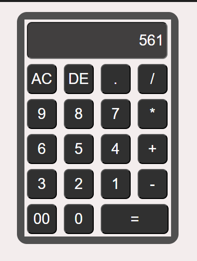

# JS_Calculator
A functional calculator web app with features like AC, delete, and basic arithmetic operations, built using HTML, CSS, and JavaScript.

## 🌐 Live Demo
[Click here to try Calculator](https://usmankhan296.github.io/JS_Calculator/)
